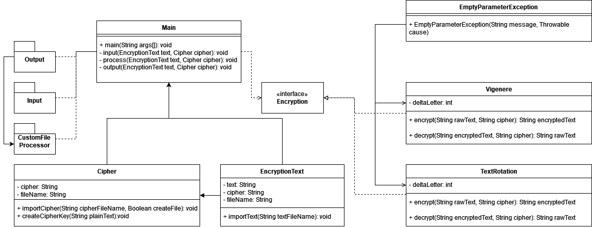

# M320 - 4
## Advanced Encryption Program - 1.1

### Description

This program encrypts plain text files using both Vigenere's cipher and a simple Rotation method

Only works with english text, special characters are ignored by the program.

